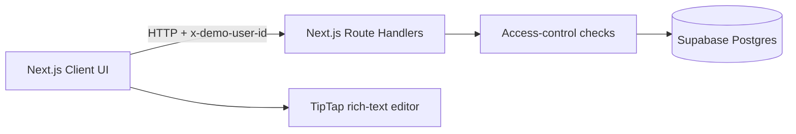

# Architecture Note

## Product Slice

Ajaia Docs is a single Next.js application deployed on Vercel with Supabase Postgres for persistence. The design prioritizes the complete reviewer journey: create, edit, persist, import, share, switch users, and confirm access.

## Components and Data Flow

- Client components own interactive UI state, the TipTap editor, selected demo identity, and debounced autosave.
- A root navigation provider displays persistent progress for internal links and programmatic redirects, while App Router loading boundaries cover route rendering.
- Route handlers validate input, resolve the selected demo user, enforce document access, sanitize HTML, and query Supabase.
- The Supabase service-role key is server-only. Browser code has no direct database access.

## Access Model

- Owners can read, edit, share, revoke access, and delete.
- Shared users can read and edit.
- Unshared users cannot read or modify a document.
- API routes perform authorization independently of what controls are visible in the UI.

The seeded user switcher intentionally simulates authentication. In production, the `x-demo-user-id` identity would be replaced by a verified session, while the document authorization rules would remain.

## Persistence and Autosave

Documents store sanitized HTML because it preserves the required rich-text formatting with low implementation complexity. Title and content updates are debounced by 700 ms. The editor exposes saving, saved, and failure states so users understand persistence behavior.

The hosted Supabase schema has been applied and verified. The current database contains the three seeded demo users and begins with no documents or sharing records.

## Tradeoffs and Next Steps

Real-time co-editing was excluded because conflict resolution and presence infrastructure would risk the required core workflow in the assessment timebox. With another 2-4 hours, priorities would be optimistic concurrency/version history, API integration tests against an isolated database, and production authentication with Supabase Auth.
